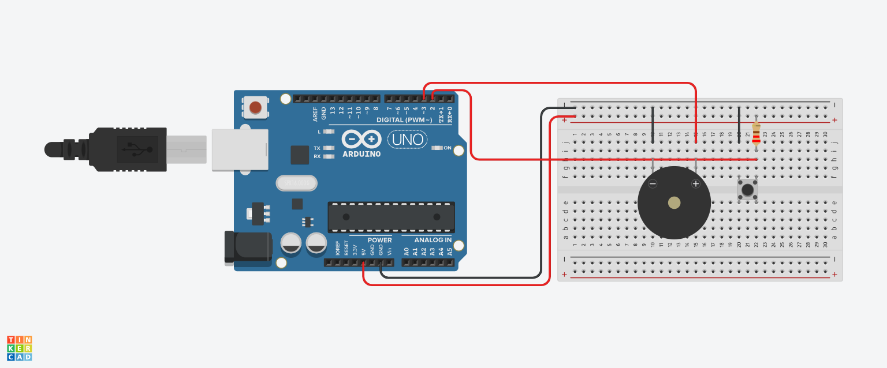

# 💣 C4 - Button & Buzzer Timer

The **C4 - Button & Buzzer Timer** is an Arduino project that simulates a countdown timer. When a button is pressed, it starts counting up to 10 seconds. If the button remains pressed for 10 seconds, the buzzer activates. If the button is released, the countdown resets.

## 📸 Circuit Diagram
Connect the components as follows:


- **Button** → Digital Pin 2
- **Passive Buzzer** → Digital Pin 3
- **Resistor (10kΩ)** → Pull-down for button
- **Arduino Board** (e.g., Arduino Uno)

## 🔧 Features
✅ **Countdown Timer**: Increments every second while the button is held.
✅ **Buzzer Activation**: Sounds when 10 seconds are reached.
✅ **Auto Reset**: Releasing the button resets the countdown.
✅ **Serial Monitor Output**: Displays countdown progress.

## 🚀 How It Works
1. **Press & Hold the Button**: The timer starts counting.
2. **Monitor the Serial Output**: Each second is printed.
3. **At 10 Seconds**: The buzzer turns on.
4. **Release the Button**: The timer resets, and the buzzer stops.

## 📜 Code
```cpp
#define BUTTON 2
#define BUZZER 3
#define TIME 1000

void setup() {
  Serial.begin(9600);
  pinMode(BUTTON, INPUT_PULLUP);
  pinMode(BUZZER, OUTPUT);
}

void loop() {
  int i = 0;

  while (digitalRead(BUTTON) == LOW) {
    i++;
    Serial.print("You have pressed the button for: ");
    Serial.println(i);
    delay(TIME);
    
    if (i == 10) {
      Serial.println("You have pressed it for 10 seconds **BOOM**");
      tone(BUZZER, 1000);
    }
  }
  noTone(BUZZER);
}
```

## 📢 Notes
- Use **INPUT_PULLUP** to avoid floating input issues.
- Adjust the **delay(TIME)** if you need a different timing.
- The **tone() function** activates the buzzer at 1kHz.
- Ensure the **button is wired correctly** (pull-down resistor recommended).

🔥 Have fun with your C4 countdown simulation! 🔥

